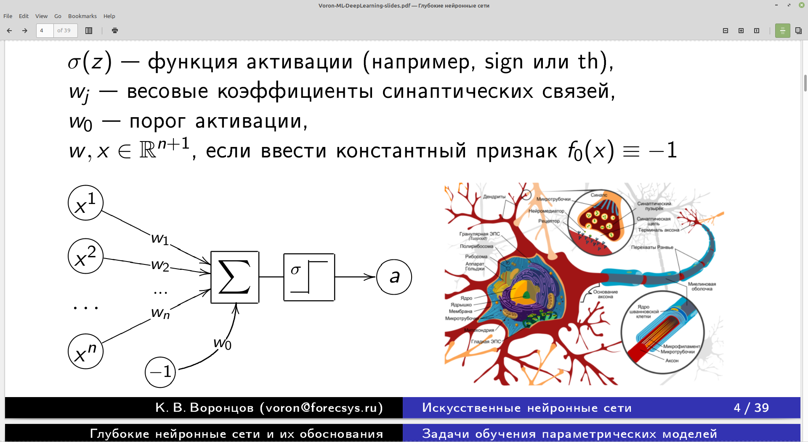
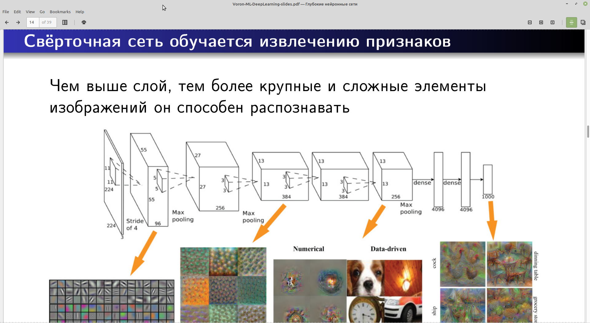

# web-приложение с сервисом детектирования трещин на дороге и загруженности перекрестка

## Подготовка к запуску:
- Перед запуском необходимо установить библиотеку pytorch для python: pip3 install torch==1.6.0+cpu torchvision==0.7.0+cpu -f https://download.pytorch.org/whl/torch_stable.html
(если на компьютере есть Nvidia GPU можно установить CUDA и pytorch для ускорения вычислений)
- Нужно установить дополнительные модули для python: pip3 install -r requirements.txt
- Необходимо создать SQLite db (файл webapp.db) для нашего веб-приложения: python3 create_db.py
- Создание пользователей перед запуском: python3 create_admin.py

## Запуск веб-приложения:
- Для Windows: set FLASK_APP=webapp && set FLASK_ENV=development && set FLASK_DEBUG=1 && flask run
- Для Unix/Mac: ./run_webapp.sh или
export FLASK_APP=webapp && export FLASK_ENV=development && export FLASK_DEBUG=1 && flask run

## Меню веб-приложения:
- Главная страница
- Логин
- Выход
- Подсчет машин на фото
- Поиск дефектов на асфальте
- Статистика запросов

## Чат-бот для детектирования трещин на дороге и загруженности перекрестка

## Подготовка к запуску:
- Создайте нового Чат-бота (В Telegram необходимо подключиться к каналу BothFather и запустить команду /newbot создания нового Чат-бота и API_KEY для него)
- Пожалуйста создайте новый инстанс mongo DB или Mongo Atlas инстанс (mongoatlas.org)
- Необходимо установить библиотеку pytorch для python (pytorch.org): pip3 install torch==1.6.0+cpu torchvision==0.7.0+cpu -f https://download.pytorch.org/whl/torch_stable.html
- Нужно установить дополнительные модули для python: pip3 install -r requirements.txt
- Необходимо создать файл object_detection/settings.py с конфигурацией:
API_KEY = "<API KEY для вашего Чат-бота>"
MONGO_PWD = "<пароль mongodb>"
MONGO_LINK = "<mongodb url>"

При первом запуске две torch-модели будут загружены с pytorch.org

## Запуск Object-Detection Telegram Bot:
запустите из директории object_detection: python3 bot.py

## Меню Чат-бота:
- Подсчет машин на фото
- Поиск дефектов на асфальте
- Статистика запросов

## Детектирование трещин на дороге на основе Convolutional Neural Networks

Во всех нейросетях используется нелинейная модель нейрона

В ноутбуках приведены нейросети из лекций К. Воронцова

===================================================================================
# Object-Detection Web-app (road check and cars localization)
This Web-app detects cars and road defects on the images

## Preparation before start
- Please install torch and torchvision like this: pip install torch==1.6.0+cpu torchvision==0.7.0+cpu -f https://download.pytorch.org/whl/torch_stable.html
- Please install required python packages: pip install -r requirements.txt
- Create SQLite db like this: python create_db.py
- Create users like this: python create_admin.py

On first run the two torch models will be downloaded in the background from pytorch.org.

## Starting Object-Detection web-application:
- Run from root folder: set FLASK_APP=webapp && set FLASK_ENV=development && set FLASK_DEBUG=1 && flask run (Windows)
- Run from root folder: export FLASK_APP=webapp && export FLASK_ENV=development && export FLASK_DEBUG=1 && flask run (Unix/Mac)

## Web-app menu:
- Главная страница (Main page)
- Логин (login)
- Выход (logout)
- Подсчет машин на фото (Cars detection)
- Поиск дефектов на асфальте (Defects detection)
- Статистика запросов (Overall statistics)

## Object-Detection telegram chat-bot (road check and cars localization)
This telegram chat-bot detects cars and road defects on the images

## Preparation before start
- Please install torch and torchvision like this: pip install torch==1.6.0+cpu torchvision==0.7.0+cpu -f https://download.pytorch.org/whl/torch_stable.html
- Please install required python packages: pip install -r requirements.txt
- Object-Detection Telegram Bot requires MongoDB instance or Mongo Atlas instance to be created
- Please create new chat bot (In Telegram try to join BothFather channel and run /newbot)
- Create file object_detection/settings.py with API KEY for your chat bot:
API_KEY = "<chat-bot API KEY>"
MONGO_PWD = ""
MONGO_LINK = "mongodb+srv:/"

## Starting Object-Detection Bot:
- Run from object_detection folder: python bot.py

## chat-bot menu:
- Подсчет машин на фото (Cars detection)
- Поиск дефектов на асфальте (Defects detection)
- Статистика запросов (Overall statistics)

